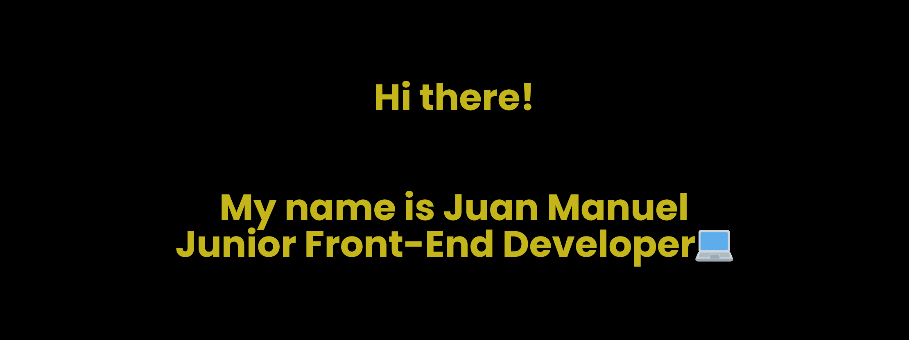

<h1>About Me!</h1>

<h2 align="center"> I'm a junior frontend developer from Popayán, Colombia. I like very much create web apps with React.js, easy to use, and developed with the best practices. 👋🧑‍💻</h2>

- 🌱 I’m currently learning React Native for mobile apps.
- 📫 How to reach me:
  https://www.linkedin.com/in/juan-manuel-l-0560bb140/
  
 <h3 align="left">Languages and Tools:</h3>

 
    
    
   
  

